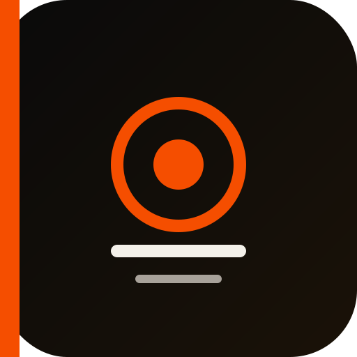
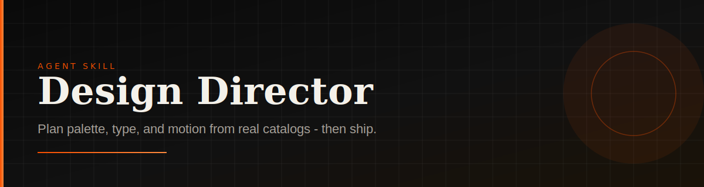
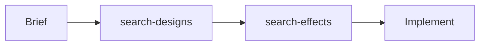

<p align="center">
  
</p>

<h1 align="center">Design Director</h1>

<p align="center">
  <strong>Plan colors, fonts, and motion from real catalogs — then ship UI.</strong><br />
  An agent skill for Cursor, Claude Code, Codex, and 60+ agents via <code>npx skills</code>.
</p>

<p align="center">
  <a href="https://github.com/shivtchandra/design-director/stargazers"></a>
  <a href="https://github.com/shivtchandra/design-director/blob/main/LICENSE"></a>
  <a href="https://github.com/shivtchandra/design-director/commits/main"></a>
</p>

<p align="center">
  
</p>

## Install (30 seconds)

```bash
npx skills add shivtchandra/design-director -g
```

Then in any agent chat:

```
Use the design-director skill. Plan first (brief + tokens + 2–3 effects), then …
```

---

## What you get

| Capability | Detail |
|------------|--------|
| Design systems | ~74 brands searchable by mood / slug (colors + fonts) |
| Motion recipes | ~71 portfolio effects across 9 categories |
| Snippets | HTML for all effects · React for many |
| Workflow | Forced plan-first: brief → tokens → motion → implement |
| Packaging | Works after install — no monorepo required at runtime |

---

## How it works



1. Lock product, audience, tone (3 adjectives).  
2. Query real systems — don’t invent purple-gradient defaults.  
3. Pick 2–4 effects; pull HTML/React snippets.  
4. Build against the brief.

---

## Demo

**Search design systems**

```bash
node scripts/search-designs.js "dark cinematic"
```

```text
## Design Systems (8 shown)

| Slug        | Primary   | Fonts                                      | Score |
|-------------|-----------|--------------------------------------------|-------|
| airtable    | #181d26   | Haas Groot Disp, Haas                      | 15    |
| composio    | #0007cd   | abcDiatype, JetBrains Mono                 | 10    |
| ferrari     | #da291c   | FerrariSans                                | 10    |
| linear.app  | #5e6ad2   | Linear Display, Linear Text                | 10    |
| mintlify    | #0a0a0a   | Inter, Geist Mono                          | 10    |
…
```

**Pull a React effect snippet**

```bash
node scripts/search-effects.js "24" --react
```

```text
### 24. Magnetic button (Cursor)
- Snippets: HTML yes · React yes

#### React Hook/Component
export function useMagnetic(strength = 0.12, radius = 80) { … }
```

Paths are relative to the installed skill folder (e.g. `~/.agents/skills/design-director/`).

---

## Vs other design skills

| | Prose skills<br>(`frontend-design`, `web-design-guidelines`) | **Design Director** |
|--|--------------------------------------------------------------|---------------------|
| Guidance | Taste, polish, audit rules | Locked tokens + motion choices |
| Data | Little / none | Catalogs + searchable CLI |
| Output | Advice | Copy-paste snippets |
| Best used as | Primary taste layer | **Companion** that makes decisions concrete |

Install both: guidelines for review, Design Director for direction + assets.

---

## Example prompts

**New landing page**

```
Use the design-director skill. Design a landing page for a boutique running brand called “Voltstride” — dark, athletic, editorial. Plan first (brief + tokens + 2–3 effects), then build a single page.
```

**SaaS waitlist**

```
Use the design-director skill. Plan first (brief + tokens + 2–3 effects), then build a waitlist landing page for “Relaykit” — calm, precise, product-led. One hero, email CTA, no dashboard chrome.
```

**With generated hero imagery**

```
Use the design-director skill. Same Voltstride brief. After locking tokens, generate a full-bleed hero image (and up to 2 supporting stills) matching the palette, then implement.
```

**Revamp an existing page**

```
Use the design-director skill. Plan first (brief + tokens + 2–3 effects), then revamp @src/pages/HomePage.jsx. Keep routing and copy; replace palette, type, and motion. Tone: dark, cinematic, technical.
```

More verticals (agency, restaurant, ecommerce, event, fintech, multi-page unify, mobile-first, plan-only, …): [skills/design-director/references/example-prompts.md](skills/design-director/references/example-prompts.md)

---

## CLI recipes

After install, from the skill directory:

```bash
node scripts/search-designs.js "brutalist editorial"
node scripts/search-designs.js --slug cursor

node scripts/search-effects.js "magnetic"
node scripts/search-effects.js "05" --html
node scripts/search-effects.js --cat "Scroll" --complexity easy
```

---

## Package contents

| Skill | Use when |
|-------|----------|
| [`design-director`](skills/design-director/) | Full visual planning (mood → tokens → motion → build) |
| [`portfolio-effects`](skills/portfolio-effects/) | Effects only — look already decided |

```bash
npx skills add shivtchandra/design-director --list
npx skills add shivtchandra/design-director --skill design-director -g -y
```

---

## License

[MIT](LICENSE)
